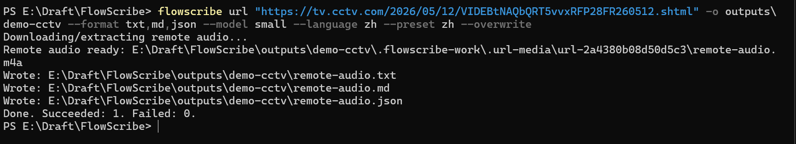
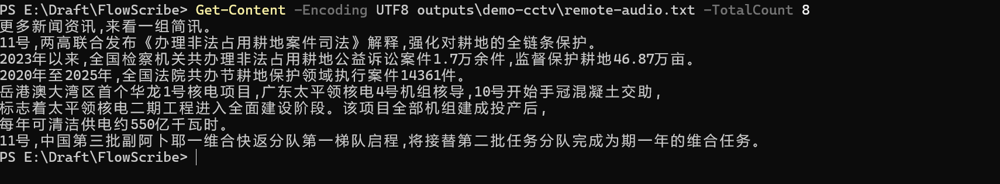

# FlowScribe

[](https://github.com/Ducker-Fry/FlowScribe/actions/workflows/ci.yml)
[](https://github.com/Ducker-Fry/FlowScribe/releases)
[](LICENSE)
[](pyproject.toml)
[](docs/packaging.md)

> 本地优先的音视频转录工具。  
> 把本地文件、公开 URL 和长录音，快速变成可搜索、可编辑、可重新导出的文字资产。

> Local-first transcription for audio and video.  
> Turn local files, public URLs, and long recordings into searchable, editable, reusable text assets.

FlowScribe 面向 Windows，提供两条主路径：

- `CLI`：适合批处理、自动化、长音频转录和结构化输出
- `GUI`：适合打开结果、搜索定位、人工校对、重新导出

FlowScribe is built for Windows and gives you two strong paths:

- `CLI`: batch work, automation, long-media transcription, structured outputs
- `GUI`: review, search, edit, and re-export in a desktop workspace

<p align="center">
  
</p>

## 为什么是 FlowScribe / Why FlowScribe

- 本地优先，核心转录和结果处理都围绕本地工作流设计。 / Local-first, with core transcription and result handling designed around local workflows.
- 一套工具同时覆盖本地媒体、公开 URL、长音频渐进式转录。 / One toolchain for local media, public URLs, and progressive long-audio transcription.
- 输出不仅有 `txt` 和 `md`，还有适合继续处理的 `json`、`srt`、`vtt`。 / Outputs include `txt`, `md`, plus downstream-friendly `json`, `srt`, and `vtt`.
- GUI 不是“另一个启动器”，而是完整的复核工作区：搜索、分段浏览、媒体同步、编辑、再导出。 / The GUI is not just a launcher. It is a full review workspace for search, segment navigation, media sync, editing, and re-export.
- 支持 `Queue` 和书签服务器，适合把网页链接一键送入待处理队列。 / Queue and bookmarklet server support make it easy to send web pages into a batch pipeline.

## 30 秒看懂它能做什么 / What You Get In 30 Seconds

```powershell
flowscribe doctor
flowscribe model download small
flowscribe transcribe "D:\media\lecture.mp4" -o outputs --format txt,md,json
flowscribe url "https://www.youtube.com/watch?v=VIDEO_ID" -o outputs
flowscribe gui
```

你会得到：

- 本地文件或 URL 的转录结果
- 可搜索的 `json`
- 可直接交付的 `txt`、`md`、`srt`、`vtt`
- 可在 GUI 中继续复核和修订的 transcript 工作区
- 可通过浏览器书签持续投递的批量 URL 队列

You get:

- transcript outputs from local files or public URLs
- searchable `json`
- directly usable `txt`, `md`, `srt`, and `vtt`
- a GUI workspace for review and correction
- a browser-fed batch URL queue through the bookmarklet flow

## 一键收集网页，批量慢慢转 / Collect Now, Process In Batch Later

> 把浏览器变成 FlowScribe 的采集入口。  
> Turn your browser into FlowScribe's intake channel.

这是 FlowScribe 很有辨识度的一条路径：

- 启动本地书签服务
- 在浏览器里点击书签，把当前页面 URL 送进 `Queue`
- 交给 GUI 后台慢慢批量处理

One of FlowScribe's most distinctive workflows:

- start the local bookmarklet service
- click the bookmarklet in your browser to send the current page into `Queue`
- let the GUI process the backlog at your own pace

<p align="center">
  
</p>

适合这类场景：

- 连续刷课程、访谈、播客页面时顺手收集
- 先囤一批 URL，稍后统一转录
- 把“发现内容”和“真正处理内容”拆成两个节奏

Great for:

- collecting course, interview, or podcast pages as you browse
- saving a batch of URLs first and transcribing later
- separating content discovery from heavy processing time

## 适合谁 / 立即开始 / Who It Is For / Start Here

适合这些人：

- 想把课程、讲座、会议、访谈快速整理成文字的人
- 需要做字幕、归档、检索或 RAG 前处理的人
- 更偏好 Windows 本地工作流，而不是把音视频直接丢到云端的人

Best for people who:

- want fast text versions of lectures, meetings, courses, and interviews
- need subtitles, archives, search, or RAG preprocessing assets
- prefer Windows local workflows instead of uploading media to cloud tools first

立即开始：

- 想先跑通 CLI：看 [用户指南](docs/user-guide.md) / [English](docs/user-guide-en.md)
- 想直接上手桌面界面：看 [GUI 用户指南](docs/gui-user-guide.md) / [English](docs/gui-user-guide-en.md)
- 想下载现成版本：看 [发布安装说明](docs/release-installation.md) / [English](docs/release-installation-en.md)
- 想直接下载构建产物：看 [Releases](https://github.com/Ducker-Fry/FlowScribe/releases)

Start here:

- CLI first: [中文](docs/user-guide.md) / [English](docs/user-guide-en.md)
- GUI first: [中文](docs/gui-user-guide.md) / [English](docs/gui-user-guide-en.md)
- packaged install help: [中文](docs/release-installation.md) / [English](docs/release-installation-en.md)
- release downloads: [Releases](https://github.com/Ducker-Fry/FlowScribe/releases)

## 两条主工作流 / Two Main Workflows

### CLI：快、稳、适合批量 / CLI: Fast, Stable, Batch-Friendly

当前最稳的 CLI 主路径是：

- `transcribe`：转录本地文件、文件夹、长音频
- `url`：下载公开 URL 后转录
- `search`：在转录 JSON 里做关键词定位
- `inspect`：先检查媒体或 URL 是否值得处理
- `model`：查看、下载、删除、导入模型

The most stable CLI paths right now are:

- `transcribe`: local files, folders, and long media
- `url`: transcribe after downloading from a public URL
- `search`: keyword search in transcript JSON
- `inspect`: inspect media or URL before processing
- `model`: list, download, remove, and import models

```powershell
flowscribe transcribe "D:\media\lecture.mp4" -o outputs
flowscribe transcribe "D:\media\long.mp4" -o outputs --progressive --resume
flowscribe transcribe "D:\media\chinese.mp4" -o outputs --preset zh
flowscribe inspect "D:\media\lecture.mp4"
flowscribe search "outputs\lecture.json" "机器学习" --limit 10
```

### GUI：看、搜、改、导出 / GUI: View, Search, Edit, Export

当前 GUI 的主线结构是：

- `Single Task`：处理单个本地文件或单个 URL
- `Queue`：批量任务、URL 队列、书签服务器入口
- `Library`：查看历史转录与产物
- `Open View`：查看运行细节、搜索 transcript、编辑 segment、重新导出

The current GUI structure centers on:

- `Single Task`: one local file or one URL
- `Queue`: batch jobs, URL queue, bookmarklet server entry
- `Library`: transcript history and generated artifacts
- `Open View`: run details, transcript search, segment editing, and re-export

推荐 GUI 路径：

1. 在 `Single Task` 里加入文件或 URL
2. 完成转录后点击 `Open View`
3. 在 `Workspace` 里搜索、校对、重新导出

Recommended GUI path:

1. add a file or URL in `Single Task`
2. finish the run and open `Open View`
3. search, correct, and re-export in `Workspace`

如果你主要处理网页内容，另一条很强的路径是：

1. `flowscribe serve`
2. 在浏览器安装书签脚本
3. 边看边把页面丢进 `Queue`
4. 回到 GUI 统一处理和复核

If web pages are your main source, this is another strong path:

1. `flowscribe serve`
2. install the bookmarklet in your browser
3. send pages into `Queue` as you browse
4. return to the GUI to process and review in batch

## 现在就能看到的界面 / What It Looks Like

| CLI | Transcript Workspace |
| --- | --- |
|  |  |

## 模型怎么选 / Model Recommendations

- 日常默认：`small` / Recommended daily default: `small`
- 中文优先：`paraformer-zh` / Chinese-first path: `paraformer-zh`
- 更高质量本地模型：`large-v3-turbo`、`large-v3` / Higher-quality local models: `large-v3-turbo`, `large-v3`
- 快速试跑：`tiny` / Quick smoke tests: `tiny`

```powershell
flowscribe model list-available
flowscribe model list-installed
flowscribe model download small
flowscribe model download paraformer-zh
```

如果你使用 `--preset zh` 且没有显式指定 `--provider`，当前会优先切到 `paraformer`。  
If you use `--preset zh` without explicitly setting `--provider`, FlowScribe currently prefers `paraformer`.

## 安装 / Install

### pip

```powershell
pip install flowscribe
pip install flowscribe[gui]
```

验证环境 / Verify the environment:

```powershell
flowscribe doctor
```

### 从源码运行 / Run From Source

```powershell
git clone https://github.com/Ducker-Fry/FlowScribe.git
cd FlowScribe
python -m venv .venv
.\.venv\Scripts\Activate.ps1
python -m pip install -e .[gui,dev]
```

启动 GUI / Start the GUI:

```powershell
flowscribe gui
```

### 便携版 / 安装版 / Portable And Installed Builds

- [发布安装说明](docs/release-installation.md) / [English](docs/release-installation-en.md)
- [打包说明](docs/packaging.md) (`English only for now`)
- [Releases](https://github.com/Ducker-Fry/FlowScribe/releases)

## 本地服务与书签 / Local Service And Bookmarklet

如果你希望从浏览器快速把页面 URL 丢进 FlowScribe，可以启动本地服务：

```powershell
flowscribe serve
```

当前默认地址 / Default endpoints:

- 服务 / service: `http://127.0.0.1:8765`
- 书签脚本 / bookmarklet script: `http://127.0.0.1:8765/bookmarklet.js`

相关文档 / Related docs:

- [书签集成指南](docs/bookmarklet.md) / [English](docs/bookmarklet-en.md)
- [书签快速开始](docs/bookmarklet-quickstart.md) / [English](docs/bookmarklet-quickstart-en.md)

## 当前最稳的使用边界 / Current Stable Boundaries

- 正式工作流优先使用本地文件、公开 URL、`Queue`、`json` 复核。 / Prefer local files, public URLs, `Queue`, and `json`-based review for serious work.
- CLI 里的 `capture` 入口目前仍是占位，不应当作已实现功能。 / The CLI `capture` entry is still a placeholder and should not be treated as implemented.
- GUI 的 `System Audio Capture` 区块仍在完善中，现阶段不要把它当成最稳主路径。 / GUI `System Audio Capture` is still being refined and should not be treated as the most stable primary path yet.

## 文档入口 / Documentation

用户文档 / User-facing docs:

- [用户指南](docs/user-guide.md) / [English](docs/user-guide-en.md)
- [GUI 用户指南](docs/gui-user-guide.md) / [English](docs/gui-user-guide-en.md)
- [VAD 指南](docs/vad-guide.md) / [English](docs/vad-guide-en.md)
- [Inspect 命令](docs/inspect.md) / [English](docs/inspect-en.md)
- [Cookies 使用说明](docs/cookies.md) / [English](docs/cookies-en.md)
- [代理配置](docs/proxy.md) / [English](docs/proxy-en.md)
- [发布安装说明](docs/release-installation.md) / [English](docs/release-installation-en.md)
- [书签集成指南](docs/bookmarklet.md) / [English](docs/bookmarklet-en.md)
- [书签快速开始](docs/bookmarklet-quickstart.md) / [English](docs/bookmarklet-quickstart-en.md)

暂时仅英文或待第二期补齐 / English-only for now or planned for phase two:

- [JSON 格式](docs/json-format.md) (`English only for now`)
- [打包说明](docs/packaging.md) (`English only for now`)
- [Agent API Guide](docs/agent-api.md) (`English only for now`)
- [开发状态](docs/dev-state.md) (`Chinese only for now`)
- [Whisper.cpp 引擎规划](docs/whispercpp-engine-plan.md) (`English only for now`)
- [发布自动化](docs/release-automation.md) (`English only for now`)
- [项目路线图](docs/roadmap.md) (`English only for now`)

## 适合什么场景 / Good Fits

- 课程、讲座、会议、访谈的本地转录 / local transcription for courses, lectures, meetings, and interviews
- 公开视频和播客的文字整理 / turning public videos and podcasts into text assets
- 字幕生成与校对 / subtitle generation and correction
- 需要把录音结果继续交给搜索、RAG、自动化流程处理的场景 / pipelines that continue into search, RAG, or automation

## 不适合什么场景 / Not For

- 绕过版权保护或 DRM / bypassing DRM or copyright protections
- 未经授权处理和分发受限内容 / unauthorized processing or redistribution of restricted content
- 把尚未完成的系统音频捕获路径当成生产主方案 / treating unfinished system-audio capture as the primary production path

详见 / See [伦理与边界](docs/ethics-and-boundaries.md).

## 贡献 / Contributing

```powershell
python -m pytest
python -m ruff check src tests
```

欢迎提交 Issue 和 Pull Request。  
Issues and pull requests are welcome.

## 许可证 / License

[MIT](LICENSE)
