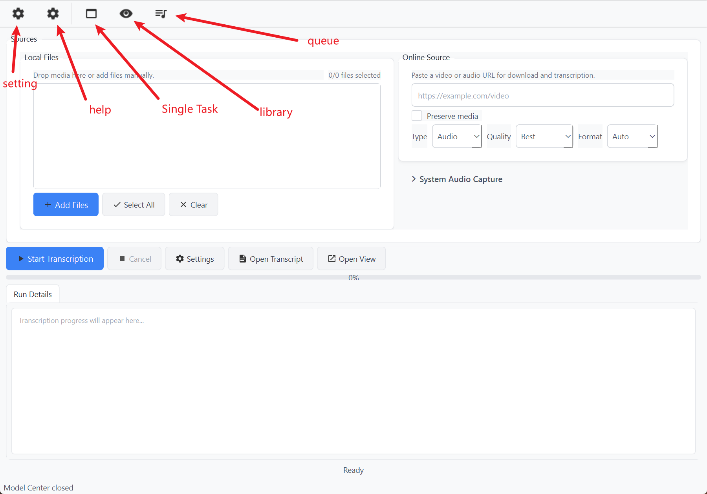
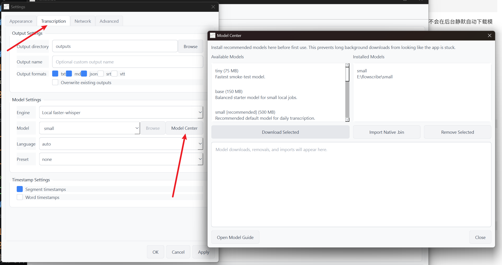
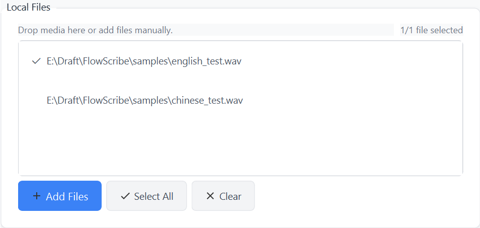
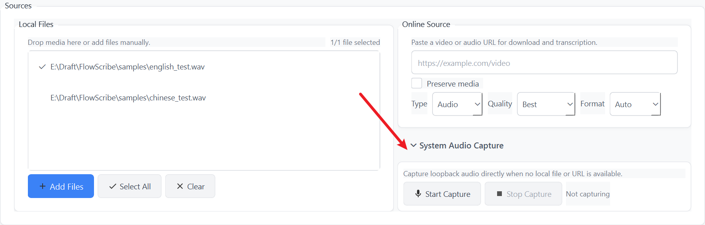
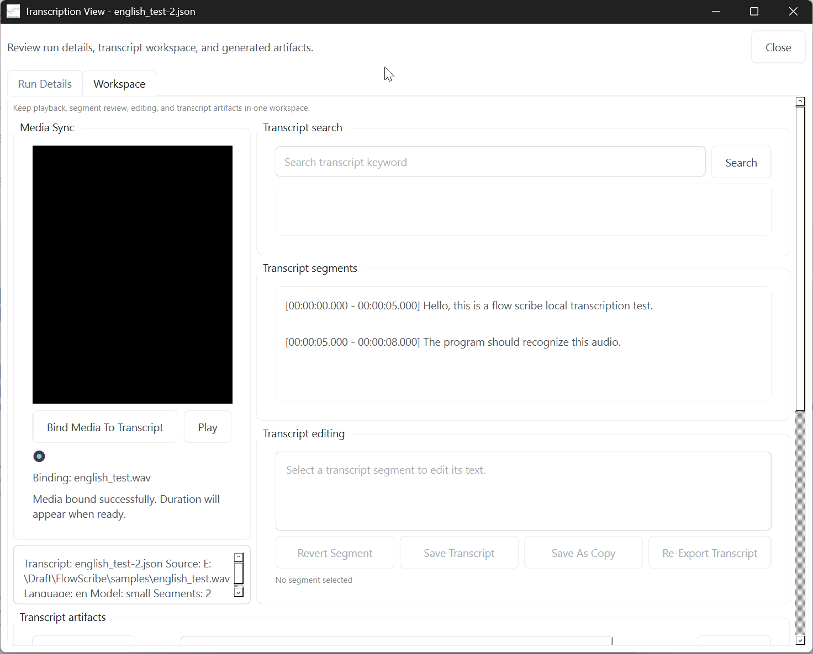
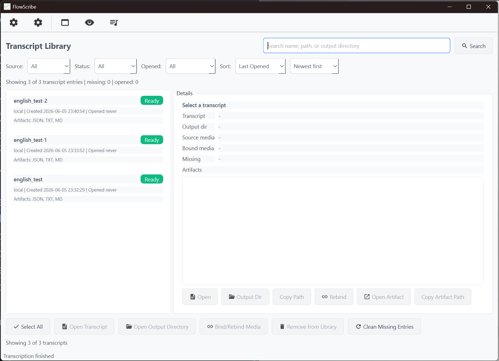
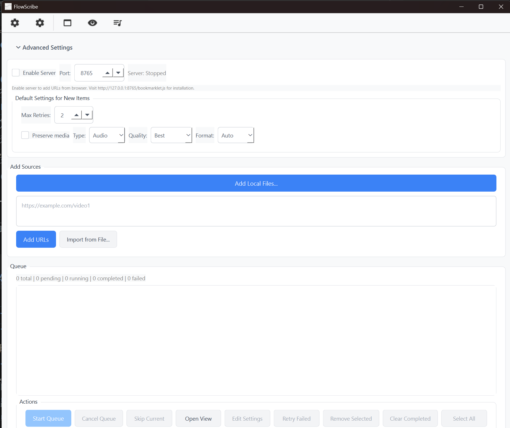
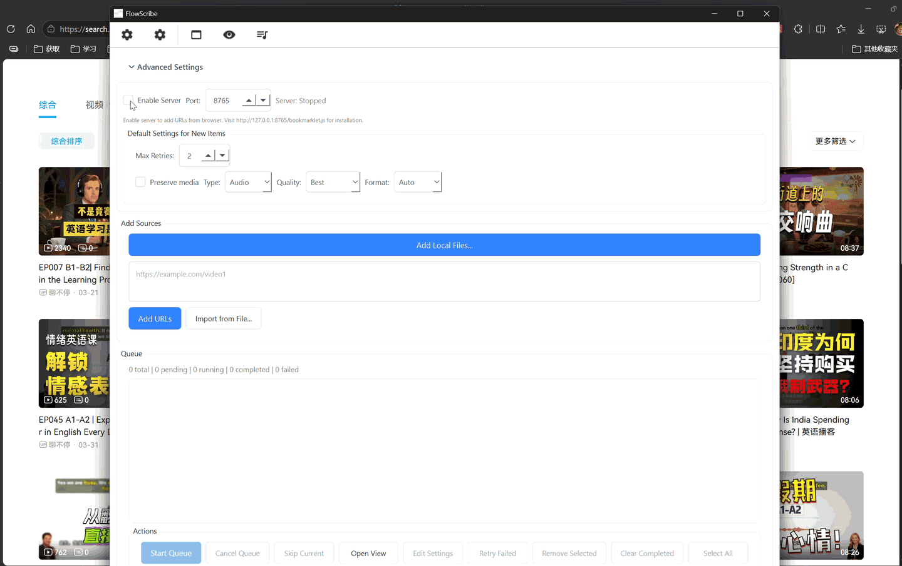

# 中文 | [English](gui-user-guide-en.md)

# FlowScribe GUI 用户指南
> 版本：v0.3.6  
> 更新日期：2026-06-05  
> 适用平台：Windows 10/11
## 1. 先看全局
FlowScribe GUI 目前围绕 3 个顶层视图工作：
- `Single Task`：处理单次转录，适合本地文件或单个 URL。
- `Library`：浏览历史转录、打开产物、清理缺失记录。
- `Queue`：批量排队处理本地文件和 URL。
顶部工具栏还提供：
- `Settings`：全局设置。
- `Help`：打开本地帮助文档。
> 
## 2. 快速开始
### 2.1 启动
便携版直接运行：
```text
FlowScribeGUI.exe
```
如果你使用的是安装版，首次启动时可能会提示先下载模型。当前安装版默认不会在后台静默自动下载模型，这是为了避免“看起来像卡死”的长等待。
### 2.2 首次建议做的两件事
1. 打开 `Settings`，确认输出目录和输出格式。
2. 打开 `Model Center`，先下载至少一个模型。
推荐起点：
- 日常本地转录：`small`
- 中文优先：`paraformer-zh`
- 快速试跑：`tiny`
> 
### 2.3 第一次完成一条转录
推荐先走这条最稳定的路径：
1. 进入 `Single Task`。
2. 点击 `Add Files`，加入一个本地音频或视频文件。
3. 在文件列表里勾选要处理的文件。
4. 点击 `Start Transcription`。
5. 在下方 `Run Details` 查看进度。
6. 转录结束后点击 `Open View`，进入查看和编辑窗口。
> 
## 3. Single Task 视图
`Single Task` 是当前最直接、最稳定的 GUI 入口。
### 3.1 本地文件
左侧 `Local Files` 区域支持：
- `Add Files`
- `Select All`
- `Clear`
- 拖放文件到列表
- 对每个文件单独勾选是否参与本次转录
状态摘要会显示为 `已勾选数量 / 总文件数`。
> 
### 3.2 URL 来源
右侧 `Online Source` 区域支持输入单个 URL，并设置下载偏好：
- `Preserve media`
- `Type`：`Audio` / `Video`
- `Quality`：`Best` / `High` / `Medium` / `Low`
- `Format`：`Auto` 或指定封装格式
回车可以直接开始当前 URL 的转录。
这条路径适合处理单个视频页面；如果你要一次加很多 URL，更适合去 `Queue` 视图。
### 3.3 Start / Cancel / Settings / Open Transcript / Open View
控制区的几个按钮分别对应：
- `Start Transcription`：启动当前任务
- `Cancel`：请求取消当前任务
- `Settings`：打开全局设置
- `Open Transcript`：打开现有的转录 JSON
- `Open View`：打开查看窗口
其中有两个容易混淆的点：
- `Open Transcript` 目前只接受有效的 `.json` 转录文件，不是任意输出产物。
- `Open View` 在任务进行中也能打开，用来查看实时 `Run Details`，任务完成后则会显示完整工作区。
### 3.4 Run Details
`Single Task` 页面下半区保留了一个内嵌的 `Run Details` 标签页，用来显示：
- 进度消息
- 分阶段状态文本
- 处理过程中的告警或取消提示
完整的查看、搜索、编辑和产物预览不在这里完成，而是在 `Open View` 打开的独立窗口里完成。
### 3.5 系统音频捕获入口
界面中有 `System Audio Capture` 折叠区，包含：
- `Start Capture`
- `Stop Capture`
- 捕获状态标签
但按当前主界面代码状态，这部分仍处于持续完善中。现阶段更稳妥的做法是：
- 优先转录本地文件
- 或先通过外部方式录成音频文件，再导入 FlowScribe
如果你打算在 GUI 里正式依赖系统回采流程，建议等后续版本把这条路径完全接通后再投入生产使用。
> 
## 4. Open View 查看窗口
`Open View` 是当前 GUI 里最重要的后处理窗口。它分成两个标签页：
- `Run Details`
- `Workspace`
### 4.1 Run Details
这里会显示：
- 当前运行日志
- 已完成任务的运行输出
- 如果结果对象里包含耗时，则显示总耗时
### 4.2 Workspace 概览
`Workspace` 把几类动作放在一个窗口里：
- 媒体绑定与播放
- 转录搜索
- 分段浏览
- 文本编辑
- 产物预览
> 
### 4.3 媒体绑定与播放
如果转录 JSON 中已经记录了媒体路径，窗口会尝试自动绑定。否则你可以手动点击：
```text
Bind Media To Transcript
```
绑定后可以：
- 播放媒体
- 拖动时间轴
- 点击搜索结果或分段时跳转到对应时间
### 4.4 搜索与分段
`Workspace` 支持：
- 关键词搜索
- 点击搜索结果跳转
- 查看全部分段
- 点击分段并同步媒体位置
这部分对调校长转录、定位某句话、回看原始语音很有用。
### 4.5 编辑转录文本
当前 GUI 支持对转录 JSON 的分段文本做校对编辑。
工作方式是：
1. 在分段列表里选择一个 segment。
2. 在编辑区修改文本。
3. 选择保存方式：
   - 覆盖原 JSON
   - 另存为修正副本
重要边界：
- 这里编辑的是 segment 文本，不会重新跑模型。
- 编辑会保留分段顺序和时间戳。
### 4.6 从 JSON 重新导出产物
如果当前打开的是有效转录 JSON，`Workspace` 允许你重新导出：
- `txt`
- `md`
- `json`
- `srt`
- `vtt`
重新导出前，如果当前文本还有未保存编辑，界面会先要求你保存。
### 4.7 产物预览
`Workspace` 会把可查看的产物集中展示，便于快速切换查看：
- `.json`
- `.md`
- `.txt`
- `.srt`
- `.vtt`
适合用来做这些事：
- 对比不同输出格式
- 复制内容给下游工具
- 检查修订后的导出是否符合预期
## 5. Library 视图
`Library` 用来管理历史转录记录。
### 5.1 会记录什么
当 GUI 完成一次转录并产出 JSON 后，程序会尝试把它加入转录库，并关联：
- transcript 路径
- 输出目录
- 来源类型
- 已生成产物
- 可能的媒体绑定
### 5.2 可以做什么
`Library` 当前支持：
- 搜索名称、路径、输出目录
- 按来源过滤：`All / Local / URL / Capture / Unknown`
- 按状态过滤：可用 / 缺失
- 按是否打开过过滤
- 排序：`Last Opened / Created / Name`
### 5.3 详情区操作
选中一条记录后，右侧详情区支持：
- `Open`
- `Output Dir`
- `Copy Path`
- `Rebind`
- `Open Artifact`
- `Copy Artifact Path`
如果记录已经失效，还可以做缺失项清理。
> 
## 6. Queue 视图
`Queue` 适合批量处理。
### 6.1 添加任务
你可以通过 3 种方式往队列里加内容：
- `Add Local Files...`
- 粘贴多行 URL 后点击 `Add URLs`
- `Import from File...`
URL 输入框支持：
```text
Ctrl+Enter
```
作为快速提交。
### 6.2 新任务默认设置
`Queue` 页面对“新加入的任务”提供一组默认选项：
- `Max Retries`
- `Preserve media`
- `Type`
- `Quality`
- `Format`
这些默认值只影响新加入的队列项，不会自动回写已存在项。
### 6.3 队列操作
队列区支持：
- 内部拖动重排
- `Start Queue`
- `Cancel Queue`
- `Skip Current`
- `Open View`
- `Edit Settings`
- `Retry Failed`
- `Remove Selected`
- `Clear Completed`
- `Select All`
### 6.4 批量编辑单项设置
`Edit Settings` 会打开队列项设置对话框，可批量修改：
- 输出目录、输出名、输出格式
- 模型与 provider
- 语言和 preset
- 时间戳选项
- 渐进式参数
- 网络参数
- URL 媒体相关参数
如果是 URL 队列项，还能设置：
- 是否保留下载媒体
- 媒体类型
- 是否自动绑定到转录
### 6.5 书签服务器
`Queue` 视图内置浏览器书签服务器入口，位于 `Advanced Settings` 折叠区。
当前界面支持：
- `Enable Server`
- 自定义端口
- 查看运行状态
默认安装地址提示为：
```text
http://127.0.0.1:8765/bookmarklet.js
```
这条路径适合把浏览器页面 URL 一键送进队列。
> 
> 
## 7. Settings 对话框
`Settings` 分成 4 个标签页。
### 7.1 Appearance
当前用于切换主题。
### 7.2 Transcription
这里管理全局转录默认值：
- 输出目录
- 输出文件名基底
- 输出格式
- 是否覆盖已有输出
- provider / model / language / preset
- 段级时间戳
- 词级时间戳
其中 `Model Center` 按钮会打开模型管理窗口。
### 7.3 Network
这里的设置主要影响 URL 来源：
- `Network family`
- `Proxy`
- `Cookies file`
### 7.4 Advanced
这里是渐进式转录参数：
- 是否启用 progressive
- 是否启用 resume
- chunk 时长
- 最大 worker 数
- native threads
## 8. Model Center
`Model Center` 负责本地模型管理。
当前支持：
- 查看可下载模型
- 下载选中模型
- 查看已安装模型
- 删除已安装模型
- 导入本地 `whisper.cpp` `.bin` 模型
- 打开本地 Model Guide
适合这些场景：
- 安装版首次启动前先把模型准备好
- 使用 `native-engine` 时导入自己的 `.bin` 文件
- 清理不用的模型节省空间
## 9. 推荐使用方式
如果你想尽量稳定，建议优先按下面的顺序使用 GUI：
### 9.1 单文件或少量文件
走 `Single Task`：
1. 加本地文件
2. 勾选文件
3. 开始转录
4. 完成后 `Open View`
5. 在 `Workspace` 里搜索、校对、重新导出
### 9.2 大量 URL
走 `Queue`：
1. 粘贴多行 URL 或导入文件
2. 先确认默认下载参数
3. 启动队列
4. 对已完成项用 `Open View` 逐个复核
### 9.3 历史结果复查
走 `Library`：
1. 搜索记录
2. 打开 transcript 或 artifact
3. 必要时重新绑定媒体
## 10. 当前边界与注意事项
这部分非常重要。
### 10.1 `Open Transcript` 主要面向 JSON
当前 `Single Task` 里的 `Open Transcript` 按钮会校验 `segments` 字段，因此应把它理解为“打开转录 JSON”，而不是“打开任意转录产物”。
### 10.2 系统音频捕获入口仍在完善
主界面已经有 `System Audio Capture` 区块，但当前主要稳定路径仍然是：
- 本地文件
- 单个 URL
- 批量队列
如果你要做正式工作，暂时不要把系统回采当成最稳的入口。
### 10.3 高级导出配置不要参考旧版手册
旧版文档里出现过“命名导出配置”“独立 API 章节”“GUI 命令行批量启动参数”等大段内容。当前主界面代码并没有以那种方式暴露这些能力，所以本手册不再保留那类说明。
