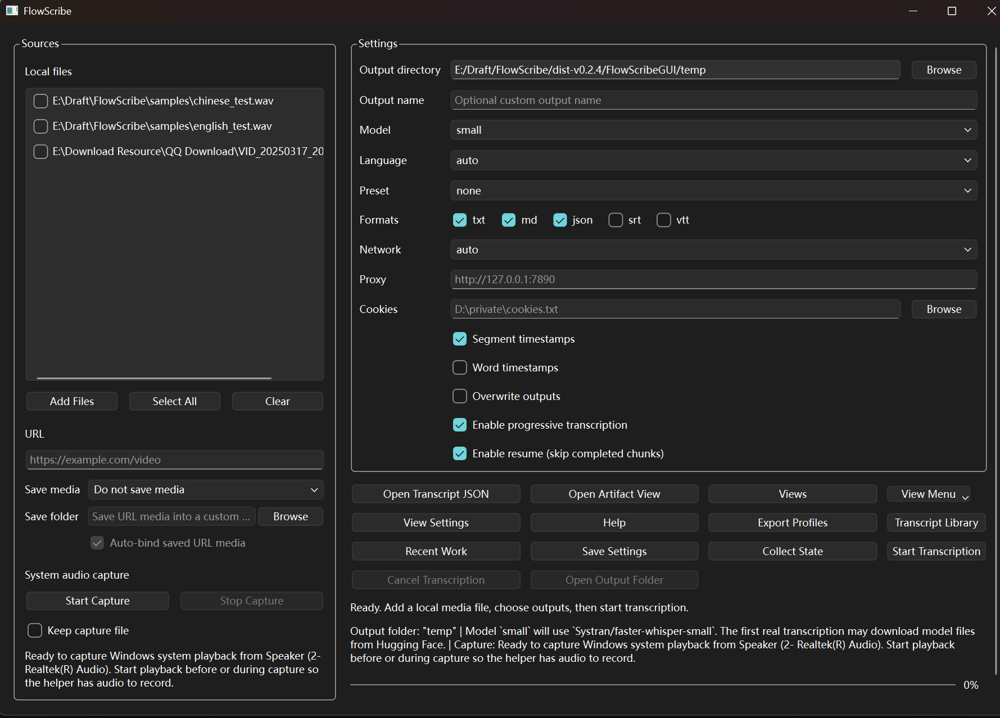
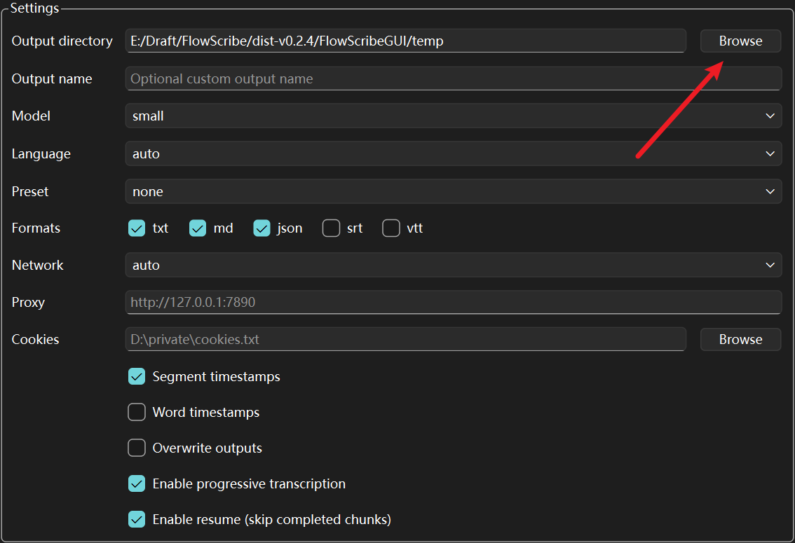
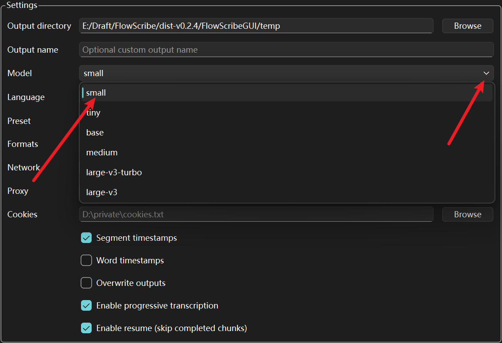
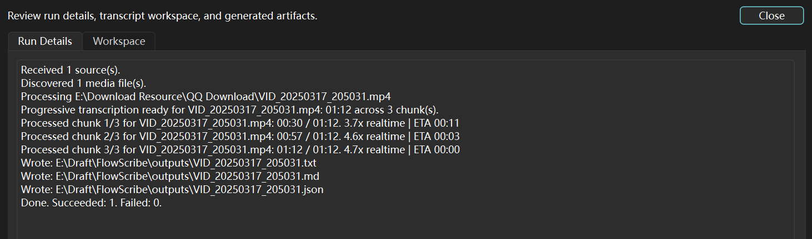
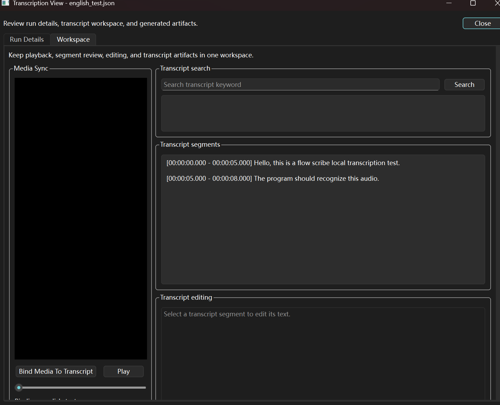
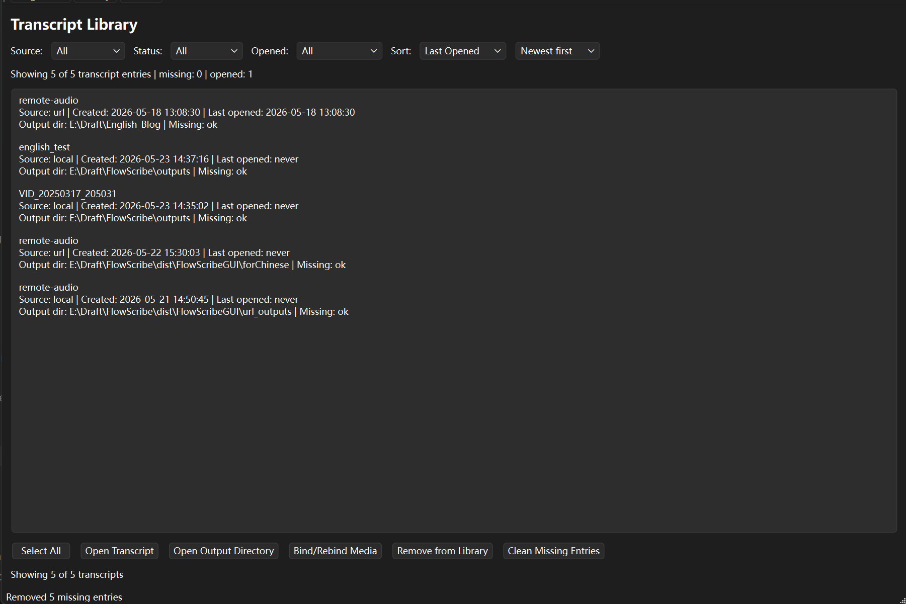
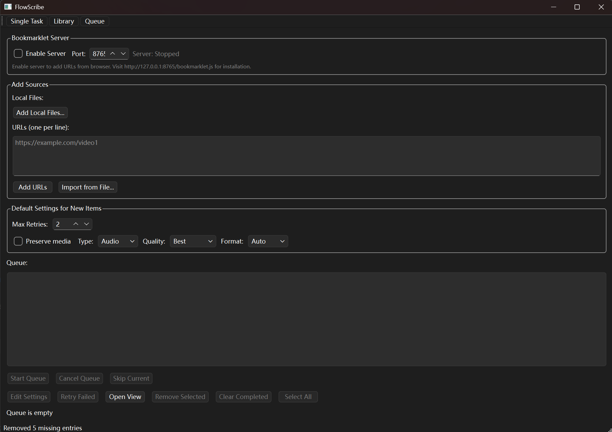
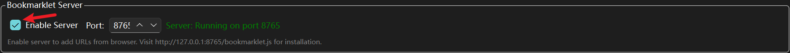
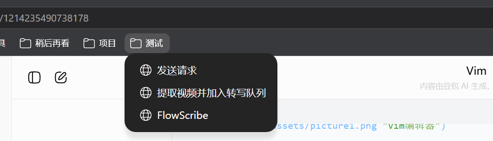

# FlowScribe GUI 用户手册

> **版本**: v0.3.3  
> **更新日期**: 2026-05-23  
> **适用平台**: Windows 10/11

---

## 目录

1. [快速开始](#1-快速开始)
2. [单任务视图](#2-单任务视图single-task)
3. [转录库视图](#3-转录库视图library)
4. [批处理队列视图](#4-批处理队列视图queue)
5. [设置对话框](#5-设置对话框settings)
6. [转录查看与编辑](#6-转录查看与编辑)
7. [常见工作流程](#7-常见工作流程)
8. [常见问题](#8-常见问题gui专属)
9. [快捷键和技巧](#9-快捷键和技巧)
10. [高级功能](#10-高级功能)
11. [附录](#11-附录)

---

## 1. 快速开始

### 1.1 安装与启动

#### 下载便携版

FlowScribe GUI 提供免安装的便携版本，无需安装即可使用。

1. 访问 [GitHub Releases](https://github.com/Ducker-Fry/FlowScribe/releases) 页面
2. 下载最新版本的 `FlowScribeGUI-vX.X.X-windows-x64.zip`
3. 解压到任意目录（建议路径不包含中文和空格）


#### 首次运行

双击 `FlowScribeGUI.exe` 启动应用程序。



#### 系统要求

- **操作系统**: Windows 10 (1809+) 或 Windows 11
- **处理器**: 支持 AVX 指令集的 x64 处理器
- **内存**: 最低 4GB RAM（推荐 8GB 以上）
- **磁盘空间**: 至少 2GB 可用空间（用于模型和临时文件）
- **依赖组件**:
  - **ffmpeg/ffprobe**: 用于音视频处理（已内置）
  - **WasapiCaptureHelper.exe**: 用于系统音频捕获（已内置）

> **提示**: 首次运行时，程序会自动检测依赖组件。如果缺少必要组件，会在状态栏显示警告。

---

### 1.2 首次使用向导

首次启动时，建议完成以下配置：

#### 设置输出目录

1. 在 **"输出设置"** 选项卡中，点击 **"浏览"** 按钮
2. 选择一个用于保存转录结果的文件夹（例如 `D:\Transcripts`）



> **建议**: 选择一个容量充足的磁盘，避免使用系统盘（C:）。

#### 选择 Whisper 模型

1. 在 **"转录设置"** 选项卡中，从 **"模型"** 下拉菜单选择一个模型
2. 推荐首次使用选择 **"small"** 模型（平衡速度和准确度）
3. 点击 **"确定"** 保存



**模型对比**:

| 模型 | 大小 | 速度 | 准确度 | 适用场景 |
|------|------|------|--------|----------|
| tiny | ~75MB | 最快 | 较低 | 快速测试、实时字幕 |
| base | ~145MB | 快 | 中等 | 日常使用、清晰音频 |
| small | ~466MB | 中等 | 良好 | **推荐首选** |
| medium | ~1.5GB | 慢 | 很好 | 高质量需求 |
| large | ~3GB | 最慢 | 最好 | 专业级转录 |

> **提示**: 首次选择模型时，程序会自动下载。下载时间取决于网络速度（small 模型约需 5-10 分钟）。

---

### 1.3 第一次转录

完成基本设置后，让我们进行第一次转录：

#### 步骤 1: 选择音频文件

1. 切换到 **"单任务"** 视图（默认视图）
2. 点击 **"添加文件"** 按钮
3. 选择一个音频或视频文件（支持 MP3、WAV、MP4、MKV 等常见格式）
4. 文件会显示在源列表中


> **支持的格式**: MP3, WAV, M4A, AAC, FLAC, OGG, MP4, MKV, AVI, MOV, WMV 等（通过 ffmpeg 支持）

#### 步骤 2: 开始转录

1. 确认源列表中有文件
2. 点击 **"开始转录"** 按钮
3. 观察进度条和状态信息


**进度信息说明**:
- **进度条**: 显示整体完成百分比
- **状态文本**: 显示当前处理阶段（准备音频、转录中、后处理等）
- **实时速度**: 显示转录速度（例如 "4.2x" 表示处理 1 分钟音频只需 14 秒）
- **预计剩余时间**: 根据当前速度估算

#### 步骤 3: 查看结果

转录完成后：

1. 状态栏显示 **"转录完成"**
2. 点击 **"打开输出目录"** 按钮查看生成的文件
3. 或点击 **"查看转录"** 按钮在程序内查看和编辑


**生成的文件**（默认在输出目录下）:
```
输出目录/
├── audio_filename.txt          # 纯文本格式
├── audio_filename.md           # Markdown 格式
├── audio_filename.json         # 完整转录数据（包含时间戳）
├── audio_filename.srt          # SRT 字幕文件
└── audio_filename.vtt          # WebVTT 字幕文件
```

> **提示**: 可以在设置中选择需要的输出格式，不必生成所有格式。

---

## 2. 单任务视图（Single Task）

单任务视图是最常用的界面，用于处理单个或少量音频文件的转录任务。


### 2.1 界面布局

单任务视图分为三个主要区域：

1. **源选择区域**（顶部）
   - 本地文件选择
   - URL 输入
   - 系统音频捕获
   - 打开已有转录

2. **转录控制区域**（中部）
   - 开始/停止按钮
   - 进度显示
   - 状态信息

3. **运行详情与工作区**（底部，可折叠）
   - 运行详情：显示转录过程的详细日志
   - 工作区：查看和编辑转录结果

---

### 2.2 添加源文件

#### 方法 1: 添加本地文件

**单个文件**:
1. 点击 **"添加文件"** 按钮
2. 在文件选择对话框中选择音频或视频文件
3. 文件会添加到源列表

**多个文件**:
1. 点击 **"添加文件"** 按钮
2. 按住 `Ctrl` 键选择多个文件
3. 或按住 `Shift` 键选择连续的文件范围

**拖放添加**:
- 直接将文件从资源管理器拖放到源列表区域


#### 方法 2: 从 URL 添加

1. 切换到 **"URL"** 选项卡
2. 在输入框中粘贴视频 URL（支持 YouTube、Bilibili 等）
3. 点击 **"添加 URL"** 按钮
4. 程序会自动提取音频信息并添加到源列表


**支持的 URL 来源**:
- YouTube (youtube.com, youtu.be)
- Bilibili (bilibili.com)
- Twitter/X (twitter.com, x.com)
- 其他支持 yt-dlp 的网站（500+ 个）

> **注意**: URL 转录需要网络连接，下载时间取决于视频大小和网络速度。

#### 方法 3: 系统音频捕获

捕获系统正在播放的音频（例如在线会议、网页视频）：

1. 切换到 **"系统音频"** 选项卡
2. 点击 **"开始捕获"** 按钮
3. 播放要转录的音频内容
4. 点击 **"停止捕获"** 按钮结束录制
5. 捕获的音频会自动添加到源列表


**系统要求**:
- 需要 `WasapiCaptureHelper.exe`（已内置）
- 仅支持 Windows 10/11
- 捕获系统音频输出（扬声器/耳机播放的声音）

> **提示**: 系统音频捕获不会录制麦克风输入，只录制系统播放的声音。

#### 方法 4: 打开已有转录

如果已经有转录 JSON 文件，可以直接打开查看和编辑：

1. 点击 **"打开转录"** 按钮
2. 选择之前生成的 `.json` 转录文件
3. 转录内容会在工作区中显示


---

### 2.3 管理源列表

#### 查看源信息

源列表显示每个文件的：
- **文件名/URL**
- **时长**（如果可检测）
- **文件大小**（本地文件）
- **状态图标**（本地文件/URL/系统音频）


#### 移除源

- **单个移除**: 选中文件，点击 **"移除选中"** 按钮
- **清空列表**: 点击 **"清空列表"** 按钮移除所有源

#### 重新排序

- 拖动源列表中的项目可以调整处理顺序
- 转录时会按列表顺序依次处理

---

### 2.4 转录控制

#### 开始转录

1. 确保源列表中至少有一个源
2. 点击 **"开始转录"** 按钮
3. 程序会依次处理列表中的所有源


#### 停止转录

- 点击 **"停止转录"** 按钮可以中止当前转录
- 已完成的文件会保留，未完成的文件不会生成输出

> **注意**: 停止转录后，当前正在处理的文件会被丢弃。

#### 进度监控

转录过程中，界面会实时显示：

- **整体进度条**: 当前文件的完成百分比
- **当前阶段**: 准备音频、转录中、后处理等
- **处理速度**: 实时速度（例如 "4.2x"）
- **预计剩余时间**: 基于当前速度的估算
- **已处理/总数**: 多文件时显示（例如 "2/5"）



---

### 2.5 运行详情

点击 **"运行详情"** 可展开详细日志面板，显示：

- 音频准备过程（提取、转换）
- 模型加载信息
- 分块处理进度（长音频）
- 后处理步骤（去重、对齐）
- 文件写入路径

---

### 2.6 工作区（查看转录）

转录完成后，点击 **"查看转录"** 按钮打开工作区：



#### 工作区功能

1. **文本显示**
   - 显示完整转录文本
   - 支持滚动浏览
   - 语法高亮（Markdown 格式）

2. **编辑功能**
   - 直接编辑转录文本
   - 支持撤销/重做（Ctrl+Z / Ctrl+Y）
   - 查找和替换（Ctrl+F）

3. **导出选项**
   - 重新导出为不同格式
   - 保存编辑后的内容

4. **时间戳视图**
   - 切换显示/隐藏时间戳
   - 点击时间戳定位到对应段落


---

## 3. 转录库视图（Library）

转录库是所有已完成转录的集中管理界面，提供搜索、筛选、查看和管理功能。




### 3.1 界面布局

转录库视图包含：

1. **工具栏**（顶部）
   - 筛选器（源类型、状态、是否已打开）
   - 排序选项

2. **转录列表**（中部）
   - 显示所有转录记录
   - 每条记录显示：标题、源类型、时长、创建时间、状态

3. **操作按钮**（右侧或底部）
   - 查看转录
   - 打开输出目录
   - 删除记录


---

### 3.2 浏览转录记录

#### 列表显示

每条转录记录显示：

- **标题**: 文件名或 URL 标题
- **源类型图标**: 本地文件 📁 / URL 🌐 / 系统音频 🎤
- **时长**: 音频长度（例如 "15:32"）
- **创建时间**: 转录完成时间
- **状态**: 已完成 ✓ / 失败 ✗
- **已打开标记**: 是否在工作区中打开过


#### 排序选项

点击列标题可按以下方式排序：

- **按时间**: 最新优先 / 最旧优先（默认）
- **按标题**: 字母顺序 A-Z / Z-A
- **按时长**: 最长优先 / 最短优先
- **按源类型**: 本地文件 / URL / 系统音频分组


---

#### 筛选器

使用筛选器快速定位特定类型的转录：

**按源类型筛选**:
- 全部
- 本地文件
- URL
- 系统音频

**按状态筛选**:
- 全部
- 已完成
- 失败

**按打开状态筛选**:
- 全部
- 已打开
- 未打开


---

### 3.4 管理转录记录

#### 查看转录

1. 选中一条转录记录
2. 点击 **"查看转录"** 按钮
3. 转录内容会在工作区中打开

或者：
- 双击转录记录直接打开


#### 打开输出目录

1. 选中一条转录记录
2. 点击 **"打开输出目录"** 按钮
3. 系统文件管理器会打开该转录的输出文件夹

> **提示**: 可以快速访问生成的所有格式文件（TXT、Markdown、JSON、SRT、VTT）。

#### 重新导出

如果需要更改输出格式或重新生成文件：

1. 选中一条转录记录
2. 点击 **"重新导出"** 按钮
3. 在对话框中选择新的输出格式
4. 点击 **"导出"** 确认


**重新导出用途**:
- 添加之前未选择的输出格式
- 修改输出文件名
- 更新到新的输出目录

> **注意**: 重新导出会覆盖同名文件。

#### 删除记录

删除不需要的转录记录：

1. 选中一条或多条转录记录（按住 `Ctrl` 多选）
2. 点击 **"删除"** 按钮
3. 确认删除操作


**删除选项**:
- **仅删除记录**: 从库中移除记录，保留输出文件
- **删除记录和文件**: 同时删除记录和所有输出文件

> **警告**: 删除文件操作不可恢复，请谨慎操作。

---

### 3.5 自动索引

转录库会自动索引以下来源的转录：

- **单任务视图**: 完成的转录自动添加到库
- **批处理队列**: 队列中完成的任务自动添加到库
- **手动导入**: 可以手动添加现有的转录 JSON 文件


---

## 4. 批处理队列视图（Queue）

批处理队列用于管理大量转录任务，支持本地文件和 URL 的批量添加、排队处理和进度跟踪。




### 4.1 界面布局

批处理队列视图包含：

1. **添加任务区域**（顶部）
   - 本地文件添加
   - URL 输入和批量导入
   - 书签小工具服务器控制

2. **队列列表**（中部）
   - 显示所有队列任务
   - 状态标记（待处理、进行中、已完成、失败）
   - 拖动排序

3. **队列控制**（底部）
   - 开始/停止队列处理
   - 清空队列
   - 移除选中任务

4. **新增项默认设置**（右侧）
   - 为新添加的任务配置默认转录参数


---

### 4.2 添加队列任务

#### 方法 1: 添加本地文件

**单个或多个文件**:
1. 点击 **"添加本地文件"** 按钮
2. 选择一个或多个音频/视频文件
3. 文件会添加到队列末尾

**拖放添加**:
- 直接将文件从资源管理器拖放到队列列表


#### 方法 2: 添加单个 URL

1. 在 **"URL"** 输入框中粘贴视频链接
2. 点击 **"添加 URL"** 按钮
3. URL 会添加到队列末尾


#### 方法 3: 批量导入 URL

从文本文件、CSV 或 Excel 批量导入 URL：

**文本文件导入** (`.txt`):
1. 点击 **"导入文件"** 按钮
2. 选择包含 URL 列表的文本文件（每行一个 URL）
3. 程序会自动解析并添加所有有效 URL

**示例文本文件**:
```
https://www.youtube.com/watch?v=example1
https://www.bilibili.com/video/BV1example2
https://www.youtube.com/watch?v=example3
```

**CSV 文件导入** (`.csv`):
- 支持包含 URL 列的 CSV 文件
- 自动识别 URL 列（列名包含 "url"、"link"、"video" 等）

**Excel 文件导入** (`.xlsx`):
- 支持 Excel 工作簿
- 自动识别包含 URL 的列


**自动去重**:
- 导入时会自动检测重复 URL
- 已在队列中的 URL（待处理、进行中、已完成）会被跳过
- 失败的 URL 可以重新添加

#### 方法 4: 从剪贴板导入

如果剪贴板中包含 URL 列表：

1. 复制包含 URL 的文本（例如从网页、文档）
2. 点击 **"从剪贴板导入"** 按钮
3. 程序会自动提取所有 URL 并添加到队列

**支持的剪贴板格式**:
- 纯文本（每行一个 URL）
- 富文本（HTML，自动提取 `<a>` 标签中的链接）


---

### 4.3 书签小工具（Bookmarklet）

书签小工具允许直接从浏览器添加 URL 到队列，无需切换到 FlowScribe GUI。


#### 启动书签小工具服务器

1. 在队列视图中，找到 **"书签小工具服务器"** 区域
2. 点击 **"启动服务器"** 按钮
3. 服务器启动后，会显示本地地址（例如 `http://127.0.0.1:8765`）




#### 安装书签小工具

1. 服务器启动后，点击 **"安装书签"** 按钮
2. 按照提示将书签拖动到浏览器的书签栏

或者手动创建书签：
1. 在浏览器中创建新书签
2. 名称设为 "FlowScribe"
3. URL 设为以下代码：

```javascript
javascript:(function(){fetch('http://127.0.0.1:8765/add-url',{method:'POST',headers:{'Content-Type':'application/json'},body:JSON.stringify({url:window.location.href,title:document.title})}).then(r=>r.json()).then(d=>alert(d.message||'已添加到FlowScribe队列')).catch(e=>alert('添加失败：'+e));})();
```




#### 使用书签小工具

1. 在浏览器中打开要转录的视频页面（例如 YouTube、Bilibili）
2. 点击书签栏中的 **"FlowScribe"** 书签
3. 页面会显示确认消息 "已添加到 FlowScribe 队列"
4. 切换回 FlowScribe GUI，队列会自动刷新并显示新任务


**优势**:
- 无需复制粘贴 URL
- 自动捕获页面标题（队列中显示标题而非 URL）
- 支持批量添加（在多个标签页中依次点击书签）

> **注意**: 书签小工具服务器仅监听本地地址（127.0.0.1），不会暴露到网络。

---

### 4.4 管理队列任务

#### 查看任务状态

队列中的每个任务显示：

- **标题/文件名**: 显示页面标题（URL）或文件名（本地文件）
- **源类型图标**: 本地文件 📁 / URL 🌐
- **状态标记**:
  - ... : 等待处理
  - \>>> : 正在转录
  - OK : 转录成功
  - ✗ : 转录失败


#### 调整任务顺序

- 拖动任务可以调整处理顺序
- 队列会按从上到下的顺序依次处理


#### 移除任务

**移除单个任务**:
1. 选中任务
2. 点击 **"移除选中"** 按钮

**移除多个任务**:
1. 按住 `Ctrl` 键选择多个任务
2. 点击 **"移除选中"** 按钮

**清空队列**:
- 点击 **"清空队列"** 按钮移除所有任务
- 会弹出确认对话框


> **注意**: 正在进行中的任务无法移除，需要先停止队列处理。

#### 重试失败任务

如果任务失败：

1. 右键点击失败的任务
2. 选择 **"重试"** 选项
3. 任务状态会重置为 "待处理"

或者：
- 点击任务右侧的 **"重试"** 按钮


**自动重试**:
- 队列处理器会自动重试失败的任务（默认最多 2 次）
- 可以在设置中调整自动重试次数

---

### 4.5 队列处理控制

#### 开始处理队列

1. 确保队列中有待处理的任务
2. 点击 **"开始队列"** 按钮
3. 队列会按顺序依次处理任务


**处理模式**:
- **顺序处理**: 一次处理一个任务（避免资源竞争）
- **自动继续**: 完成一个任务后自动开始下一个

#### 停止队列处理

- 点击 **"停止队列"** 按钮
- 当前任务会完成，后续任务暂停
- 可以随时重新开始队列处理

> **提示**: 停止队列不会中止当前正在转录的任务，只是暂停后续任务的处理。

#### 队列进度监控

队列处理时，界面会显示：

- **当前任务**: 正在处理的任务标题
- **整体进度**: 已完成/总任务数（例如 "3/10"）
- **当前任务进度**: 当前任务的完成百分比
- **预计剩余时间**: 基于平均速度的估算


---


### 4.7 单个任务设置

如果需要为特定任务使用不同的设置：

1. 右键点击队列中的任务
2. 选择 **"编辑设置"**
3. 在弹出的对话框中修改参数
4. 点击 **"确定"** 保存


**可修改的参数**:
- 所有转录参数（模型、语言、任务类型等）
- 输出设置（目录、格式、命名）
- 高级选项（VAD、渐进式、去重）

> **提示**: 任务设置在添加到队列时快照保存，后续修改全局设置不会影响已添加的任务。

---


## 7. 常见工作流程

### 7.1 单个文件快速转录

**场景**: 转录一个会议录音

1. 启动 FlowScribe GUI
2. 在单任务视图中，点击 **"添加文件"**
3. 选择会议录音文件（例如 `meeting.mp3`）
4. 点击 **"开始转录"**
5. 等待转录完成（观察进度条）
6. 点击 **"打开输出目录"** 查看结果

**预计时间**: 5 分钟音频约需 1-2 分钟（使用 small 模型）


---

### 7.2 批量转录本地文件

**场景**: 转录一批讲座录音

1. 切换到 **"批处理队列"** 视图
2. 点击 **"添加本地文件"**，选择所有讲座文件
3. 在 **"新增项默认设置"** 中配置参数（例如选择 medium 模型）
4. 点击 **"开始队列"**
5. 程序会依次处理所有文件
6. 完成后，在转录库中查看所有结果

**预计时间**: 10 个 30 分钟的讲座约需 2-3 小时（使用 small 模型）


---

### 7.3 从浏览器批量添加视频

**场景**: 转录一系列 YouTube 教程视频

1. 启动 FlowScribe GUI，切换到队列视图
2. 点击 **"启动服务器"** 启动书签小工具服务器
3. 安装浏览器书签（按提示操作）
4. 在浏览器中打开第一个 YouTube 视频
5. 点击书签栏的 **"FlowScribe"** 书签
6. 重复步骤 4-5，添加所有视频
7. 返回 FlowScribe GUI，点击 **"开始队列"**
8. 程序会自动下载并转录所有视频

**优势**:
- 无需复制粘贴 URL
- 自动捕获视频标题
- 支持快速批量添加


---

### 7.4 转录系统音频

**场景**: 转录在线会议或网页视频

1. 在单任务视图中，切换到 **"系统音频"** 选项卡
2. 点击 **"开始捕获"**
3. 播放要转录的音频内容（例如 Zoom 会议、YouTube 视频）
4. 音频播放完毕后，点击 **"停止捕获"**
5. 捕获的音频会自动添加到源列表
6. 点击 **"开始转录"**

**注意事项**:
- 确保系统音量不为静音
- 捕获期间避免播放其他音频
- 仅捕获系统输出，不录制麦克风


---


### 7.6 长音频转录（渐进式）

**场景**: 转录 2 小时的播客节目

1. 打开 **"设置"** 对话框
2. 在 **"高级设置"** 中，启用 **"渐进式转录"**
3. 设置分块大小为 30 秒，重叠 3 秒
4. 启用 **"去重"**
5. 点击 **"确定"** 保存设置
6. 在单任务视图中添加播客文件
7. 点击 **"开始转录"**
8. 程序会自动分块处理，避免内存溢出

**优势**:
- 支持任意长度的音频
- 避免时间戳漂移
- 自动去除分块边界的重复内容


---

## 8. 常见问题（GUI 专属）

### 8.1 安装和启动问题

#### Q: 双击 FlowScribeGUI.exe 没有反应？

**A**: 可能的原因和解决方法：

1. **缺少依赖组件**:
   - 确保已安装 [Microsoft Visual C++ Redistributable](https://aka.ms/vs/17/release/vc_redist.x64.exe)
   - 下载并安装后重启程序

2. **被杀毒软件拦截**:
   - 检查杀毒软件日志
   - 将 FlowScribeGUI.exe 添加到白名单

3. **路径包含中文或特殊字符**:
   - 将程序移动到纯英文路径（例如 `C:\FlowScribe`）

4. **查看日志文件**:
   - 检查 `%APPDATA%\FlowScribe\logs\` 目录下的日志文件
   - 查找错误信息

---

#### Q: 启动时提示 "缺少 ffmpeg"？

**A**: ffmpeg 应该已内置在便携版中。如果仍然提示缺少：

1. 检查程序目录下是否有 `ffmpeg.exe` 和 `ffprobe.exe`
2. 如果缺失，从 [ffmpeg.org](https://ffmpeg.org/download.html) 下载
3. 将 `ffmpeg.exe` 和 `ffprobe.exe` 放到程序目录或系统 PATH 中

---

### 8.2 转录问题

#### Q: 转录速度很慢，如何优化？

**A**: 优化建议：

1. **使用更小的模型**:
   - 将 medium/large 改为 small 或 base
   - 速度提升 2-4 倍

2. **降低 Beam Size**:
   - 在设置中将 Beam Size 从 5 降到 1
   - 速度提升 30-40%

3. **启用 VAD 过滤**:
   - 跳过静音片段
   - 速度提升 10-30%（取决于音频）

4. **启用 CPU 优化**:
   - 在设置中启用 int8 量化
   - 速度提升 15-25%

5. **使用 GPU**（如果有 NVIDIA 显卡）:
   - 安装 CUDA 和 cuDNN
   - 在设置中启用 GPU 加速
   - 速度提升 200-400%

---

#### Q: 转录结果不准确，如何改善？

**A**: 提高准确度的方法：

1. **使用更大的模型**:
   - 将 small 改为 medium 或 large
   - 准确度显著提升

2. **指定语言**:
   - 不要使用 "自动检测"
   - 手动选择正确的语言

3. **提供初始提示词**:
   - 在设置中输入相关的关键词或术语
   - 例如："技术会议，Python，机器学习"

4. **提高音频质量**:
   - 使用清晰的音频源
   - 避免背景噪音过大的录音

5. **增加 Beam Size**:
   - 将 Beam Size 从 5 增加到 8 或 10
   - 准确度提升，但速度变慢

---

#### Q: 转录中文时出现乱码或拼音？

**A**: 可能的原因和解决方法：

1. **语言设置错误**:
   - 确保在设置中选择 **"中文"** 而非 "自动检测"

2. **模型太小**:
   - tiny 和 base 模型对中文支持较弱
   - 使用 small 或更大的模型

3. **音频质量问题**:
   - 确保音频清晰，语速适中
   - 避免方言或口音过重的音频

---

#### Q: 长音频转录失败或卡住？

**A**: 解决方法：

1. **启用渐进式转录**:
   - 在设置中启用 **"渐进式转录"**
   - 自动分块处理，避免内存溢出

2. **减小分块大小**:
   - 将分块大小从 30 秒减小到 20 秒
   - 适用于内存较小的系统

3. **关闭其他程序**:
   - 释放内存和 CPU 资源
   - 避免同时运行其他重负载任务

4. **检查磁盘空间**:
   - 确保输出目录有足够的可用空间
   - 至少预留 1GB 空间

---

### 8.3 URL 下载问题

#### Q: 添加 YouTube URL 时提示 "下载失败"？

**A**: 可能的原因和解决方法：

1. **网络连接问题**:
   - 检查网络连接
   - 尝试在浏览器中打开该 URL

2. **需要代理**:
   - 在设置中配置 HTTP/HTTPS 代理
   - 例如：`http://127.0.0.1:7890`

3. **URL 格式错误**:
   - 确保 URL 完整且正确
   - 例如：`https://www.youtube.com/watch?v=xxxxx`

4. **视频不可用**:
   - 视频可能已被删除或设为私密
   - 尝试其他视频

5. **yt-dlp 需要更新**:
   - YouTube 经常更改 API
   - 等待 FlowScribe 更新或手动更新 yt-dlp

---

#### Q: Bilibili 视频下载失败？

**A**: Bilibili 视频可能需要登录或有地区限制：

1. **使用代理**:
   - 配置国内代理（如果在国外）

2. **检查视频权限**:
   - 确保视频是公开的
   - 避免会员专享或付费视频

3. **尝试其他视频**:
   - 某些视频可能有特殊保护

---

### 8.4 书签小工具问题

#### Q: 点击书签后没有反应？

**A**: 检查以下几点：

1. **服务器是否启动**:
   - 在队列视图中确认服务器状态为 "运行中"
   - 如果未启动，点击 **"启动服务器"**

2. **浏览器安全设置**:
   - 某些浏览器可能阻止 JavaScript 书签
   - 尝试在浏览器设置中允许 JavaScript

3. **端口被占用**:
   - 默认端口 8765 可能被其他程序占用
   - 在设置中更改端口号

4. **防火墙拦截**:
   - 检查防火墙是否阻止了本地连接
   - 允许 FlowScribeGUI.exe 的网络访问

---

#### Q: 书签添加成功，但队列中没有显示？

**A**: 可能的原因：

1. **队列未刷新**:
   - 点击队列视图的 **"刷新"** 按钮
   - 或等待自动刷新（每 5 秒）

2. **URL 重复**:
   - 该 URL 已在队列中（待处理、进行中或已完成）
   - 检查队列列表和转录库

3. **URL 无效**:
   - 书签小工具会验证 URL 格式
   - 确保当前页面是有效的视频页面

---

### 8.5 系统音频捕获问题

#### Q: 点击 "开始捕获" 后没有声音？

**A**: 检查以下设置：

1. **系统音量**:
   - 确保系统音量不为静音
   - 调整音量到合适的级别

2. **音频输出设备**:
   - 确保选择了正确的音频输出设备
   - 在 Windows 声音设置中检查

3. **WasapiCaptureHelper.exe**:
   - 确保程序目录下有 `WasapiCaptureHelper.exe`
   - 检查是否被杀毒软件拦截

4. **权限问题**:
   - 以管理员身份运行 FlowScribeGUI.exe
   - 某些系统需要管理员权限才能捕获音频

---

#### Q: 捕获的音频有杂音或断断续续？

**A**: 优化建议：

1. **关闭其他音频程序**:
   - 避免多个程序同时使用音频设备

2. **降低系统负载**:
   - 关闭不必要的后台程序
   - 释放 CPU 和内存资源

3. **检查音频驱动**:
   - 更新音频驱动到最新版本

4. **使用有线连接**:
   - 蓝牙音频可能有延迟和丢包
   - 使用有线耳机或扬声器

---

### 8.6 界面和操作问题

#### Q: 界面显示不完整或错位？

**A**: 可能的原因和解决方法：

1. **DPI 缩放问题**:
   - 右键 FlowScribeGUI.exe → 属性 → 兼容性
   - 勾选 **"替代高 DPI 缩放行为"**
   - 选择 **"系统（增强）"**

2. **分辨率过低**:
   - 建议最低分辨率 1280x720
   - 调整显示器分辨率

3. **窗口大小**:
   - 尝试最大化窗口
   - 或手动调整窗口大小

---

#### Q: 如何清空转录库？

**A**: 批量删除转录记录：

1. 切换到 **"转录库"** 视图
2. 按 `Ctrl+A` 全选所有记录
3. 点击 **"删除"** 按钮
4. 选择 **"仅删除记录"** 或 **"删除记录和文件"**
5. 确认删除

> **警告**: 删除操作不可恢复，请谨慎操作。

---

#### Q: 如何备份转录结果？

**A**: 备份方法：

1. **备份输出文件**:
   - 复制输出目录到备份位置
   - 默认输出目录在设置中查看

2. **备份转录库索引**:
   - 复制 `%APPDATA%\FlowScribe\library.json`
   - 恢复时将文件复制回原位置

3. **备份队列**:
   - 复制 `%APPDATA%\FlowScribe\batch-queue.json`

---

## 9. 快捷键和技巧

### 9.1 全局快捷键

| 快捷键 | 功能 |
|--------|------|
| `Ctrl+O` | 打开转录文件 |
| `Ctrl+S` | 保存当前转录 |
| `Ctrl+F` | 查找文本 |
| `Ctrl+H` | 查找和替换 |
| `Ctrl+Z` | 撤销 |
| `Ctrl+Y` | 重做 |
| `Ctrl+A` | 全选 |
| `Ctrl+C` | 复制 |
| `Ctrl+X` | 剪切 |
| `Ctrl+V` | 粘贴 |
| `F5` | 刷新当前视图 |
| `Ctrl+,` | 打开设置 |


---

### 9.2 视图切换

| 快捷键 | 功能 |
|--------|------|
| `Ctrl+1` | 切换到单任务视图 |
| `Ctrl+2` | 切换到转录库视图 |
| `Ctrl+3` | 切换到批处理队列视图 |

---

### 9.3 操作技巧

#### 快速添加文件

- **拖放**: 直接将文件拖到源列表或队列列表
- **多选**: 按住 `Ctrl` 或 `Shift` 选择多个文件
- **快捷键**: `Ctrl+O` 打开文件选择对话框

#### 快速搜索

- 在转录库中，直接输入关键词即可搜索（无需点击搜索框）
- 使用筛选器快速定位特定类型的转录

#### 批量操作

- **批量删除**: `Ctrl+A` 全选，然后点击删除
- **批量导出**: 选中多个转录，右键选择 "批量导出"

#### 工作区技巧

- **快速定位**: 在时间轴视图中，点击时间戳跳转到对应段落
- **批量替换**: 使用 `Ctrl+H` 批量替换术语或错误

---

## 10. 高级功能

### 10.1 自定义输出模板

FlowScribe 支持自定义输出文件的命名和组织方式。

#### 命名模板变量

在设置中，可以使用以下变量自定义文件名：

| 变量 | 说明 | 示例 |
|------|------|------|
| `{name}` | 源文件名（不含扩展名） | `interview` |
| `{date}` | 当前日期（YYYY-MM-DD） | `2026-05-23` |
| `{time}` | 当前时间（HH-MM-SS） | `14-30-45` |
| `{model}` | 使用的模型名称 | `small` |
| `{language}` | 转录语言 | `zh` |
| `{duration}` | 音频时长（秒） | `1234` |

**示例模板**:
```
{date}_{name}_{model}
→ 2026-05-23_interview_small.txt

{name}_transcription_{time}
→ interview_transcription_14-30-45.txt
```


---

### 10.2 批量输出策略

在批处理队列中，可以选择不同的输出组织策略：

#### 统一目录

所有转录结果保存到同一个目录：

```
输出目录/
├── video1.txt
├── video1.json
├── video2.txt
├── video2.json
└── ...
```

**适用场景**: 少量文件，便于集中管理

---

#### 按源分组

为每个源文件创建独立的子目录：

```
输出目录/
├── video1/
│   ├── video1.txt
│   ├── video1.json
│   └── video1.srt
├── video2/
│   ├── video2.txt
│   ├── video2.json
│   └── video2.srt
└── ...
```

**适用场景**: 大量文件，需要分类管理

---

#### 自定义模板

使用模板变量自定义目录结构：

```
输出目录/{date}/{name}/
→ 输出目录/2026-05-23/interview/interview.txt
```


---

### 10.3 预设配置

创建和管理转录预设，快速应用常用配置。

#### 创建预设

1. 在设置对话框中配置所有参数
2. 点击 **"保存为预设"** 按钮
3. 输入预设名称（例如 "高质量中文"）
4. 点击 **"确定"**


#### 应用预设

1. 在设置对话框中，点击 **"预设"** 下拉菜单
2. 选择已保存的预设
3. 所有参数会自动填充
4. 可以微调后再保存

**示例预设**:

**快速转录**:
- 模型: base
- Beam Size: 1
- VAD: 启用
- 用途: 快速草稿

**高质量转录**:
- 模型: large
- Beam Size: 8
- VAD: 禁用
- 用途: 最终版本

**中文会议**:
- 模型: medium
- 语言: 中文
- 初始提示词: "会议记录，技术讨论"
- 用途: 中文会议


---

### 10.4 命令行集成

FlowScribe GUI 可以通过命令行参数启动，支持自动化工作流。

#### 命令行参数

```powershell
# 启动 GUI 并自动转录文件
.\FlowScribeGUI.exe --file "C:\audio.mp3"

# 使用指定预设
.\FlowScribeGUI.exe --file "C:\audio.mp3" --preset "高质量中文"

# 批量添加到队列
.\FlowScribeGUI.exe --queue "C:\audio1.mp3" "C:\audio2.mp3"

# 启动书签小工具服务器
.\FlowScribeGUI.exe --start-server

# 自检模式（检查依赖）
.\FlowScribeGUI.exe --self-test
```


#### 批处理脚本示例

创建批处理脚本自动化转录任务：

```batch
@echo off
REM 批量转录脚本

set FLOWSCRIBE="C:\FlowScribe\FlowScribeGUI.exe"
set INPUT_DIR="D:\Recordings"
set OUTPUT_DIR="D:\Transcripts"

REM 添加所有 MP3 文件到队列
for %%f in (%INPUT_DIR%\*.mp3) do (
    %FLOWSCRIBE% --queue "%%f" --output %OUTPUT_DIR%
)

echo 所有文件已添加到队列
pause
```


---

### 10.5 API 集成（高级）

FlowScribe 提供本地 HTTP API，支持与其他应用集成。

#### 启动 API 服务器

```powershell
.\FlowScribeGUI.exe --api-server --port 8765
```

#### API 端点

**添加 URL 到队列**:
```http
POST http://127.0.0.1:8765/add-url
Content-Type: application/json

{
  "url": "https://www.youtube.com/watch?v=xxxxx",
  "title": "Video Title"
}
```

**查询队列状态**:
```http
GET http://127.0.0.1:8765/queue/status
```

**开始队列处理**:
```http
POST http://127.0.0.1:8765/queue/start
```


#### Python 集成示例

```python
import requests

# 添加 URL 到 FlowScribe 队列
def add_to_flowscribe(url, title):
    response = requests.post(
        'http://127.0.0.1:8765/add-url',
        json={'url': url, 'title': title}
    )
    return response.json()

# 使用示例
result = add_to_flowscribe(
    'https://www.youtube.com/watch?v=xxxxx',
    'My Video'
)
print(result['message'])
```


---

## 11. 附录

### 11.1 支持的文件格式

#### 音频格式

- MP3 (.mp3)
- WAV (.wav)
- M4A (.m4a)
- AAC (.aac)
- FLAC (.flac)
- OGG (.ogg)
- WMA (.wma)
- OPUS (.opus)

#### 视频格式

- MP4 (.mp4)
- MKV (.mkv)
- AVI (.avi)
- MOV (.mov)
- WMV (.wmv)
- FLV (.flv)
- WEBM (.webm)

> **注意**: 视频文件会自动提取音频轨道进行转录。

---

### 11.2 支持的 URL 来源

FlowScribe 使用 yt-dlp 支持 500+ 个网站，包括但不限于：

- **YouTube** (youtube.com, youtu.be)
- **Bilibili** (bilibili.com)
- **Twitter/X** (twitter.com, x.com)
- **Vimeo** (vimeo.com)
- **Twitch** (twitch.tv)
- **Facebook** (facebook.com)
- **Instagram** (instagram.com)
- **TikTok** (tiktok.com)
- **SoundCloud** (soundcloud.com)
- **Spotify** (spotify.com, 需要账号)

完整列表: [yt-dlp 支持的网站](https://github.com/yt-dlp/yt-dlp/blob/master/supportedsites.md)

---

### 11.3 模型下载位置

Whisper 模型会自动下载并缓存在以下位置：

**Windows**:
```
C:\Users\<用户名>\.cache\huggingface\hub\
```

**模型文件大小**:
- tiny: ~75 MB
- base: ~145 MB
- small: ~466 MB
- medium: ~1.5 GB
- large: ~3 GB

> **提示**: 如果需要清理磁盘空间，可以删除不使用的模型文件。

---

### 11.4 配置文件位置

FlowScribe 的配置和数据文件保存在：

```
%APPDATA%\FlowScribe\
├── config.json           # 全局设置
├── library.json          # 转录库索引
├── batch-queue.json      # 批处理队列
├── presets.json          # 预设配置
└── logs\                 # 日志文件
    ├── app.log
    └── error.log
```

**手动编辑配置**:
- 关闭 FlowScribe GUI
- 编辑 `config.json`
- 重新启动程序

> **警告**: 手动编辑配置文件可能导致程序异常，请谨慎操作。

---

### 11.5 性能参考

以下是不同配置下的性能参考（基于 30 分钟音频）：

| 配置 | 模型 | Beam Size | 处理时间 | 实时速度 |
|------|------|-----------|----------|----------|
| 入门 CPU | base | 1 | ~10 分钟 | 3x |
| 标准 CPU | small | 5 | ~8 分钟 | 3.75x |
| 高端 CPU | medium | 5 | ~15 分钟 | 2x |
| 入门 GPU | small | 5 | ~3 分钟 | 10x |
| 高端 GPU | large | 8 | ~2 分钟 | 15x |

> **注意**: 实际性能取决于硬件配置、音频质量和内容复杂度。

---

### 11.6 故障排除清单

遇到问题时，按以下顺序检查：

1. ☑ 检查日志文件（`%APPDATA%\FlowScribe\logs\error.log`）
2. ☑ 确认依赖组件（ffmpeg, WasapiCaptureHelper.exe）
3. ☑ 检查磁盘空间（至少 2GB 可用）
4. ☑ 检查网络连接（URL 转录）
5. ☑ 尝试重启程序
6. ☑ 尝试重置设置（设置 → 重置为默认）
7. ☑ 查看常见问题章节
8. ☑ 提交 Issue 到 GitHub

---

### 11.7 获取帮助

如果本手册无法解决您的问题，可以通过以下方式获取帮助：

- **GitHub Issues**: [https://github.com/Ducker-Fry/FlowScribe/issues](https://github.com/Ducker-Fry/FlowScribe/issues)
- **文档**: [https://flowscribe./readthedocs.io](https://flowscribe.readthedocs.io)
- **社区论坛**: [https://discuss.flowscribe.org](https://discuss.flowscribe.org)

提交问题时，请提供：
1. FlowScribe 版本号
2. 操作系统版本
3. 详细的错误描述
4. 相关的日志文件内容
5. 复现步骤

---

### 11.8 更新日志

**v0.3.0** (2026-05-23):
- 新增批处理队列视图
- 新增书签小工具功能
- 新增转录库视图
- 重构 UI 架构（QStackedWidget）
- 支持队列中添加本地文件
- 改进渐进式转录性能
- 修复多项 Bug

**v0.2.7** (2026-04-15):
- 改进 URL 下载稳定性
- 新增系统音频捕获功能
- 优化 CPU 性能（int8 量化）
- 修复中文字符编码问题

**v0.2.0** (2026-03-01):
- 首个 GUI 版本发布
- 支持本地文件和 URL 转录
- 集成 faster-whisper
- 支持多种输出格式

---

**文档结束**

> **版本**: v0.3.3  
> **最后更新**: 2026-05-23  
> **反馈**: [GitHub Issues](https://github.com/Ducker-Fry/FlowScribe/issues)
