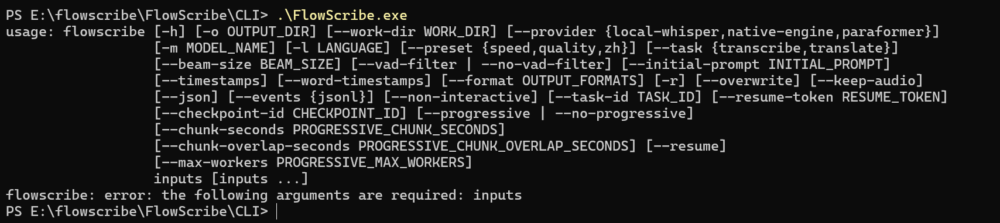
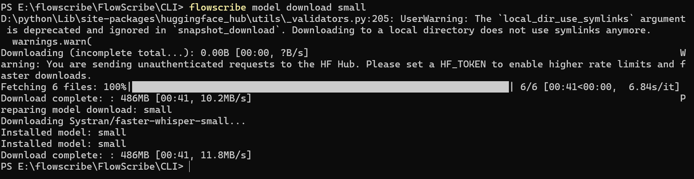
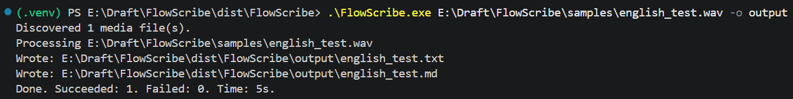
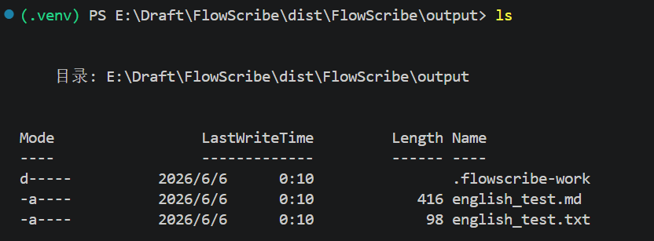

[中文](user-guide.md) | English

# FlowScribe User Guide

> Version: v0.3.7  
> Updated: 2026-06-05  
> Platform: Windows 10/11

## 1. What FlowScribe Does

FlowScribe is a local-first transcription tool focused on four main paths:

- transcribe local audio or video files
- download and transcribe media from public URLs
- run progressive chunked transcription for long recordings
- review, search, edit, and re-export transcript results in the GUI

The most stable paths in the current project are:

- CLI: `transcribe`, `url`, `search`, `inspect`, `model`
- GUI: `Single Task`, `Library`, `Queue`, `Open View`

> 
> 

## 2. Quick Start

### 2.1 Run From Source

```powershell
cd FlowScribe
python -m venv .venv
.\.venv\Scripts\Activate.ps1
python -m pip install -e .[gui,dev]
```

Verify the CLI:

```powershell
flowscribe --help
flowscribe doctor
```

Start the GUI:

```powershell
flowscribe gui
```

You can also run:

```powershell
python -m flowscribe.gui
```

### 2.2 First Things To Do

1. Run `flowscribe doctor` to verify the local environment.
2. Run `flowscribe model list-available` to see downloadable models.
3. Download one model before serious transcription work.

Recommended starting points:

- daily use: `small`
- Chinese-first path: `paraformer-zh`
- quick smoke tests: `tiny`

```powershell
flowscribe model download small
```

> 
> 

## 3. Main CLI Workflows

## 3.1 Transcribe Local Files

Transcribe a single file:

```powershell
flowscribe transcribe "D:\media\lecture.mp4" -o outputs
```

Transcribe multiple files:

```powershell
flowscribe transcribe "D:\media\a.mp4" "D:\media\b.mp3" -o outputs
```

Recursively scan a folder:

```powershell
flowscribe transcribe "D:\media" -o outputs --recursive
```

Check currently supported local input formats:

```powershell
flowscribe formats
```

## 3.2 Transcribe A Public URL

Basic URL transcription:

```powershell
flowscribe url "https://www.youtube.com/watch?v=VIDEO_ID" -o outputs
```

If you only want to inspect the source first:

```powershell
flowscribe inspect "https://www.youtube.com/watch?v=VIDEO_ID"
```

Common URL options:

```powershell
flowscribe url "https://example.com/video" -o outputs --keep-media
flowscribe url "https://example.com/video" -o outputs --proxy "http://127.0.0.1:7890"
flowscribe url "https://example.com/video" -o outputs --network-family ipv4
flowscribe url "https://example.com/video" -o outputs --download-quality high
flowscribe url "https://example.com/video" -o outputs --download-format mp3
```

For login-required sources, pass cookies explicitly:

```powershell
flowscribe url "https://example.com/video" -o outputs --cookies "D:\private\cookies.txt"
```

Only use this on content you are allowed to access. See [cookies-en.md](cookies-en.md) and [proxy-en.md](proxy-en.md) for details.

## 3.3 Progressive Long-Media Transcription

FlowScribe supports progressive chunked transcription for long lectures, meetings, and podcasts.

Enable it explicitly:

```powershell
flowscribe transcribe "D:\media\long.mp4" -o outputs --progressive
```

Customize chunk settings:

```powershell
flowscribe transcribe "D:\media\long.mp4" -o outputs --progressive --chunk-seconds 60 --chunk-overlap-seconds 5
```

Resume from cache:

```powershell
flowscribe transcribe "D:\media\long.mp4" -o outputs --resume
```

Parallel workers:

```powershell
flowscribe transcribe "D:\media\long.mp4" -o outputs --progressive --max-workers 2
```

Disable progressive mode:

```powershell
flowscribe transcribe "D:\media\long.mp4" -o outputs --no-progressive
```

Current defaults:

- `--chunk-seconds 30`
- `--chunk-overlap-seconds 3`
- `--max-workers 1`

## 3.4 Search Existing Transcripts

Search transcript JSON:

```powershell
flowscribe search "outputs\lecture.json" "machine learning"
```

Limit results and time range:

```powershell
flowscribe search "outputs\lecture.json" "machine learning" --limit 10 --after 00:10:00 --before 00:30:00
```

Write JSON search output:

```powershell
flowscribe search "outputs\lecture.json" "machine learning" --json
```

## 3.5 Inspect Local Media

Inspect a local file:

```powershell
flowscribe inspect "D:\media\lecture.mp4"
```

This is useful for confirming:

- whether the file exists
- whether it contains an audio stream
- the rough duration
- the file format

If you see `No audio stream`, do not start transcription blindly.

## 4. Languages, Providers, And Models

## 4.1 Current Providers

The current CLI exposes three transcription providers:

- `local-whisper`
- `native-engine`
- `paraformer`

Current default behavior:

- regular tasks default to `local-whisper`
- if you use `--preset zh` without explicitly setting `--provider`, FlowScribe switches to `paraformer`

## 4.2 Common Models

The model ids you will most often see are:

- `tiny`
- `base`
- `small`
- `medium`
- `large-v3-turbo`
- `large-v3`
- `paraformer-zh`

Model commands:

```powershell
flowscribe models
flowscribe model list-available
flowscribe model list-installed
flowscribe model download small
flowscribe model download paraformer-zh
flowscribe model remove small
flowscribe model import-native "D:\models\ggml-base.en.bin"
```

## 4.3 Chinese-Oriented Workflow

The simplest Chinese-first command style:

```powershell
flowscribe transcribe "D:\media\lecture.mp4" -o outputs --preset zh
```

If you want to select `paraformer` explicitly:

```powershell
flowscribe transcribe "D:\media\lecture.mp4" -o outputs --provider paraformer --model paraformer-zh
```

If you want to stay on the faster-whisper style explicitly:

```powershell
flowscribe transcribe "D:\media\lecture.mp4" -o outputs --provider local-whisper --model medium --preset zh
```

## 4.4 English Or Multilingual Workflow

English example:

```powershell
flowscribe transcribe "D:\media\english.mp4" -o outputs --model medium --language en
```

Keep the original language instead of translating:

```powershell
flowscribe transcribe "D:\media\mix.mp4" -o outputs --task transcribe
```

Translate into English explicitly:

```powershell
flowscribe transcribe "D:\media\speech.mp4" -o outputs --task translate
```

## 5. Output Formats And Results

Default output formats:

```text
txt,md
```

Export multiple formats explicitly:

```powershell
flowscribe transcribe "D:\media\lecture.mp4" -o outputs --format txt,md,json,srt,vtt
```

Enable segment timestamps:

```powershell
flowscribe transcribe "D:\media\lecture.mp4" -o outputs --timestamps
```

Enable word timestamps:

```powershell
flowscribe transcribe "D:\media\lecture.mp4" -o outputs --format json --word-timestamps
```

Overwrite existing outputs:

```powershell
flowscribe transcribe "D:\media\lecture.mp4" -o outputs --overwrite
```

Typical output directory:

```text
outputs/
|-- lecture.txt
|-- lecture.md
|-- lecture.json
|-- lecture.srt
`-- lecture.vtt
```

`json` is usually the most important artifact because GUI review, transcript editing, search, and re-export all build on it.

> 

## 6. Bookmarklet Server And Local Service

FlowScribe provides a local HTTP service for browser bookmarklets and automation.

Start the service:

```powershell
flowscribe serve
```

Default behavior:

- listens on `http://127.0.0.1:8765`
- default output directory: `~/Documents/FlowScribe`
- default output format: `json`
- default model: `small`

Customize port and output directory:

```powershell
flowscribe serve --port 8080 -o D:\Transcripts
```

Useful endpoints:

- `POST /add-url`
- `POST /add-urls`
- `GET /status`
- `GET /bookmarklet.js`
- `POST /v1/tasks`
- `GET /v1/tasks/{task_id}`
- `GET /v1/tasks/{task_id}/events`
- `GET /v1/tasks/{task_id}/result`

Bookmarklet install URL:

```text
http://127.0.0.1:8765/bookmarklet.js
```

## 7. How GUI And CLI Fit Together

Start the GUI:

```powershell
flowscribe gui
```

or:

```powershell
python -m flowscribe.gui
```

The main GUI workflow is documented in [gui-user-guide-en.md](gui-user-guide-en.md). At a high level:

- `Single Task`: one local file or one URL
- `Library`: transcript history
- `Queue`: batch jobs and bookmarklet queue intake
- `Open View`: logs, transcript search, segment editing, re-export

CLI-generated transcript JSON can also be opened in the GUI for review.

## 8. Recommended Workflows

## 8.1 Most Stable Daily Flow

1. `flowscribe model download small`
2. `flowscribe transcribe ... --format txt,md,json`
3. use `flowscribe search ...` for keyword locating
4. move into GUI `Open View` when you need manual review

## 8.2 Chinese-First Flow

1. download `paraformer-zh`
2. use `--preset zh`
3. export `json,srt,vtt` when needed
4. use the GUI to verify text and timing

## 8.3 URL Batch Flow

1. inspect a few URLs first
2. then use `Queue` or `flowscribe serve`
3. keep `json` for important results
4. add `--keep-media` when you need the downloaded media retained

## 9. Current Boundaries

### 9.1 The `capture` CLI Is Still A Placeholder

Although `flowscribe capture` exists as an entry, it is not a finished feature yet.

### 9.2 GUI System Audio Capture Is Still Being Refined

The GUI includes a `System Audio Capture` area, but the more stable production paths right now are:

- local files
- URLs
- Queue
- JSON + `Open View` review

### 9.3 Installed Builds May Require Model Preparation First

Installed builds do not silently auto-download models on first use by default. It is better to prepare a model first, or open `Model Center` in the GUI before serious use.

## 10. Common Questions

### 10.1 `doctor` Passed But `outputs` Is Empty

That is normal. `doctor` checks the environment only. It does not create transcript outputs.

### 10.2 It Says There Is No Audio Stream

Run:

```powershell
flowscribe inspect "D:\media\video.mp4"
```

first to confirm whether the file actually contains audio.

### 10.3 The First Run Is Slow

The most common reason is first-time model download. Later runs are much faster.

### 10.4 Chinese Recognition Quality Is Not Good Enough

Try:

```powershell
flowscribe transcribe "D:\media\chinese.mp4" -o outputs --preset zh
```

If that is still not enough, try:

```powershell
flowscribe transcribe "D:\media\chinese.mp4" -o outputs --provider local-whisper --model medium --preset zh
```

### 10.5 URL Download Failed

Check first:

- whether you need a proxy
- whether you need cookies
- whether forcing `ipv4` helps
- whether the source site supports the link format you provided

## 11. Related Docs

- [gui-user-guide-en.md](gui-user-guide-en.md) - full GUI workflow
- [vad-guide-en.md](vad-guide-en.md) - when VAD helps and when it hurts
- [release-installation-en.md](release-installation-en.md) - portable and installer builds
- [cookies-en.md](cookies-en.md) - login-required media access
- [proxy-en.md](proxy-en.md) - proxy configuration
- [inspect-en.md](inspect-en.md) - inspect command details
- [json-format.md](json-format.md) - transcript JSON format (`English only for now`)
